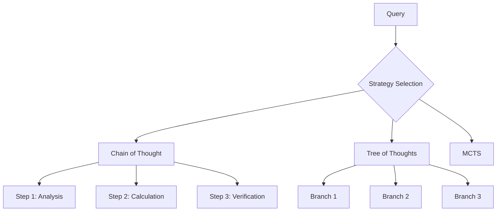

# PRP: Comprehensive ReasonIt System Improvements

**PRP ID**: COMP-IMP-001  
**Status**: Draft  
**Priority**: High  
**Created**: 2025-07-04  
**Author**: Claude Code  

## Executive Summary

This PRP outlines a comprehensive improvement plan for the ReasonIt LLM reasoning architecture based on:
1. **Architecture Compliance Analysis**: Addressing gaps between current implementation and Architecture.md specification
2. **User Experience Enhancement**: Making the system more interactive and visual
3. **Code Quality Improvements**: Enhancing maintainability, testing, and performance
4. **Integration Optimization**: Better component coordination and workflow

**Overall Current Compliance**: 75% - Good foundation but missing key components  
**Target Compliance**: 95% - Near-complete architectural vision realization

## Part I: Architecture Compliance Improvements

### 1. Implement Missing Self-Proving Module
**Priority**: HIGH  
**Effort**: 2-3 weeks  
**Impact**: Enables formal verification and mathematical proof generation

**Current State**: `/proofs/` directory exists but is empty (0% implemented)

**Implementation Plan**:
- Create `proof_generator.py` with formal verification capabilities
- Implement certificate generation for mathematical proofs
- Add constraint checking for logical consistency  
- Integrate with existing tools for automated proof validation
- Support for multiple proof strategies (direct, contradiction, induction)

**Deliverables**:
- `proofs/proof_generator.py`
- `proofs/certificate_manager.py` 
- `proofs/formal_verifier.py`
- Integration with MCTS and CoT agents
- Test suite with mathematical proof examples

### 2. Complete Multi-Model Ensemble Implementation
**Priority**: HIGH  
**Effort**: 3-4 weeks  
**Impact**: True ensemble reasoning with multiple model endpoints

**Current State**: Framework exists (30% implemented) but lacks actual multi-model orchestration

**Implementation Plan**:
- Extend `models/` to support multiple concurrent model endpoints
- Implement ensemble voting and confidence aggregation
- Add model-specific optimization (specialized models for math, logic, creativity)
- Create load balancing and fallback mechanisms
- Integrate with adaptive controller for intelligent model selection

**Deliverables**:
- `models/ensemble_manager.py`
- `models/model_registry.py`
- Enhanced `adaptive_controller.py` with multi-model routing
- Configuration system for model endpoints
- Ensemble decision algorithms

### 3. Meta-Reasoning Knowledge Base for Tricky Problems
**Priority**: HIGH  
**Effort**: 3-4 weeks  
**Impact**: Dramatically improves handling of complex, tricky questions through strategic reasoning guidance

**Vision**: A curated knowledge base that teaches the system **HOW** to approach different types of tricky problems, not specific answers. This provides strategic reasoning patterns and logical frameworks for complex scenarios.

**Problem Examples**:
- **Logical Paradoxes**: "This statement is false" → Apply paradox resolution strategies
- **Multi-Step Deduction**: Complex logical chains → Break down systematically  
- **Ambiguous Questions**: Multiple interpretations → Clarify assumptions first
- **Counterintuitive Problems**: Against common sense → Question assumptions
- **Edge Cases**: Boundary conditions → Consider extreme scenarios

**Implementation Plan**:

#### 3.1 Problem Pattern Recognition
- **Query Classification**: Identify tricky question types (paradox, deduction, ambiguous, etc.)
- **Complexity Scoring**: Rate questions on logical complexity, ambiguity, counterintuitiveness
- **Pattern Matching**: Match incoming queries to known tricky patterns

#### 3.2 Strategic Reasoning Templates
- **Logical Deduction Framework**: 
  ```
  "For complex logical chains: 1) Identify all premises, 2) Check for hidden assumptions, 
   3) Apply formal logic rules step-by-step, 4) Verify each inference"
  ```
- **Paradox Resolution Strategies**:
  ```
  "For paradoxes: 1) Identify the contradictory elements, 2) Question the framework, 
   3) Look for hidden assumptions, 4) Consider meta-levels of reasoning"
  ```
- **Ambiguity Handling**:
  ```
  "For ambiguous questions: 1) List all possible interpretations, 2) State assumptions explicitly, 
   3) Solve for each interpretation, 4) Compare results"
  ```

#### 3.3 Strategic Knowledge Base Structure
```json
{
  "problem_patterns": {
    "logical_paradox": {
      "indicators": ["self-reference", "contradiction", "infinite_regress"],
      "strategy": "paradox_resolution_framework",
      "examples": ["liar_paradox", "sorites_paradox"],
      "meta_guidance": "Question the logical framework itself"
    },
    "complex_deduction": {
      "indicators": ["multiple_premises", "chained_inference", "hidden_assumptions"],
      "strategy": "formal_logic_framework",
      "examples": ["syllogistic_reasoning", "propositional_logic"],
      "meta_guidance": "Make all reasoning steps explicit"
    },
    "counterintuitive": {
      "indicators": ["against_common_sense", "surprising_result", "statistical_paradox"],
      "strategy": "assumption_questioning_framework",
      "examples": ["monty_hall", "birthday_paradox"],
      "meta_guidance": "Challenge intuitive assumptions"
    }
  }
}
```

#### 3.4 Integration with Reasoning Agents
- **Pre-reasoning Analysis**: Classify query before strategy selection
- **Strategy Enhancement**: Inject relevant meta-guidance into prompts
- **Dynamic Framework Selection**: Choose appropriate reasoning frameworks
- **Post-reasoning Validation**: Check results against pattern expectations

**Deliverables**:
- `knowledge/meta_reasoning_kb.py` - Core knowledge base
- `knowledge/pattern_classifier.py` - Query classification
- `knowledge/strategy_templates.py` - Reasoning frameworks
- `knowledge/guidance_injector.py` - Integration with agents
- Curated database of reasoning patterns and strategies

### 4. Wikipedia Knowledge Retrieval Module
**Priority**: HIGH  
**Effort**: 2-3 weeks  
**Impact**: Intelligent Wikipedia integration for factual questions and knowledge grounding

**Vision**: Smart Wikipedia integration that automatically detects when a question requires encyclopedic knowledge and retrieves relevant, structured information to enhance reasoning.

**Problem Examples**:
- **Historical Facts**: "When did the French Revolution start?" → Auto-search Wikipedia
- **Scientific Concepts**: "What is quantum entanglement?" → Retrieve structured explanation
- **Geographic Information**: "What's the capital of Slovenia?" → Get factual data
- **Biographical Data**: "Who was Marie Curie?" → Access comprehensive info
- **Complex Topics**: "Explain the causes of World War I" → Multi-article synthesis

**Implementation Plan**:

#### 4.1 Intelligent Wikipedia Detection
- **Query Classification**: Identify questions requiring encyclopedic knowledge
- **Entity Recognition**: Extract key entities (people, places, concepts, events)
- **Knowledge Gap Analysis**: Determine what factual information is needed
- **Confidence Scoring**: Rate likelihood that Wikipedia can help

**Detection Patterns**:
```python
{
  "factual_patterns": {
    "historical_events": ["when did", "what year", "during which period"],
    "biographical": ["who was", "who is", "biography of"],
    "geographic": ["capital of", "located in", "where is"],
    "scientific_concepts": ["what is", "explain", "how does", "definition of"],
    "statistical": ["population of", "area of", "height of", "distance"]
  }
}
```

#### 4.2 Advanced Wikipedia API Integration
- **Multi-Search Strategy**: 
  - Primary entity search
  - Disambiguation handling
  - Related article discovery
  - Section-specific extraction
- **Content Processing**:
  - Extract relevant sections (intro, key facts, infobox)
  - Filter out irrelevant content
  - Structure information hierarchically
  - Handle multiple articles for complex topics

#### 4.3 Smart Content Synthesis
- **Information Ranking**: Score relevance of different Wikipedia sections
- **Content Summarization**: Extract key facts while preserving context
- **Cross-Reference Validation**: Check consistency across multiple articles
- **Structured Data Extraction**: Parse infoboxes, tables, and structured content

#### 4.4 Integration with Reasoning Pipeline
- **Pre-Reasoning Enrichment**: Inject Wikipedia context before reasoning starts
- **Dynamic Retrieval**: Fetch additional info during reasoning if needed
- **Fact Verification**: Cross-check reasoning conclusions with Wikipedia
- **Citation Generation**: Provide Wikipedia sources for factual claims

**Example Workflow**:
```
Query: "What were the main causes of the American Civil War?"

1. Detection: Historical question identified
2. Wikipedia Search: "American Civil War causes"
3. Content Extraction: 
   - Main article sections on causes
   - Related articles (slavery, economics, states' rights)
   - Timeline information
4. Synthesis: Structured summary of key causes
5. Reasoning Enhancement: Inject context into reasoning prompt
6. Result: Comprehensive answer with Wikipedia citations
```

#### 4.5 Wikipedia Knowledge Cache
- **Intelligent Caching**: Store frequently accessed articles
- **Update Management**: Refresh cache periodically
- **Structured Storage**: Parse and store Wikipedia content in searchable format
- **Offline Capability**: Local Wikipedia dumps for high-reliability scenarios

**Deliverables**:
- `tools/wikipedia_search.py` - Core Wikipedia integration
- `tools/entity_recognizer.py` - Entity extraction for queries
- `tools/content_synthesizer.py` - Wikipedia content processing
- `tools/knowledge_detector.py` - Query classification for knowledge needs
- `cache/wikipedia_cache.py` - Intelligent caching system
- Integration with all reasoning agents for automatic knowledge injection

### 5. Enhanced Tool Orchestra with Fact Verification
**Priority**: MEDIUM  
**Effort**: 1-2 weeks  
**Impact**: Multi-source fact verification and confidence scoring

**Current State**: Tool framework solid (90%) but missing comprehensive fact verification

**Implementation Plan**:
- Integrate with multiple knowledge sources (Wikidata, academic databases)
- Cross-reference fact verification across sources
- Implement confidence scoring for factual claims
- Create semantic search capabilities for structured knowledge

**Deliverables**:
- `tools/fact_verifier.py` - Multi-source fact checking
- `tools/structured_kb.py` - Structured knowledge base queries
- Enhanced search capabilities with source attribution
- Confidence scoring for factual information

## Part II: User Experience & Visualization Improvements

### 4. Real-Time Interactive CLI with Thinking Visualization
**Priority**: HIGH  
**Effort**: 2-3 weeks  
**Impact**: Dramatically improved user experience and system transparency

**Current Issues**:
- CLI doesn't show real-time reasoning steps
- No visualization of reasoning trees/graphs
- Limited interaction during reasoning process
- No way to visualize complex reasoning strategies

**Implementation Plan**:

#### 4.1 Real-Time Thinking Display
- **Live Reasoning Trace**: Show reasoning steps as they happen using Rich Live components
- **Progress Indicators**: Visual progress bars for each reasoning strategy
- **Confidence Meters**: Real-time confidence scoring visualization
- **Cost Tracking**: Live cost monitoring during reasoning
- **Interactive Interruption**: Allow users to stop/redirect reasoning mid-process

#### 4.2 Reasoning Visualization Engine
- **Mermaid Chart Generation**: Auto-generate flow charts for reasoning processes
- **Tree Visualization**: Interactive ASCII/Unicode trees for ToT and MCTS
- **Graph Networks**: Node-edge diagrams for complex reasoning relationships
- **Strategy Flow Maps**: Visual representation of adaptive controller decisions

**Visualization Types**:


#### 4.3 Interactive Features
- **Step-by-Step Mode**: Allow users to approve each reasoning step
- **Alternative Exploration**: Show multiple reasoning paths and let users choose
- **Real-Time Configuration**: Adjust strategy parameters during execution
- **Reasoning Replay**: Visualize past reasoning sessions

**Deliverables**:
- Enhanced `cli.py` with live visualization
- `visualization/reasoning_charts.py` - Mermaid generation
- `visualization/tree_renderer.py` - Interactive tree display
- `visualization/live_display.py` - Real-time updates
- Integration with all reasoning agents for live updates

### 5. Web Dashboard Interface
**Priority**: MEDIUM  
**Effort**: 3-4 weeks  
**Impact**: Browser-based interface with advanced visualizations

**Implementation Plan**:
- FastAPI-based web interface with real-time WebSocket updates
- Interactive D3.js visualizations for reasoning trees
- Session management and reasoning history
- Multi-user support with reasoning session sharing
- Export capabilities (PDF reports, reasoning traces)

**Deliverables**:
- `web/` directory with FastAPI application
- Interactive web visualizations
- WebSocket integration for real-time updates
- User session management

## Part III: Code Quality & Performance Improvements

### 6. Comprehensive Testing Suite
**Priority**: HIGH  
**Effort**: 2-3 weeks  
**Impact**: Improved reliability and maintainability

**Current State**: 12 test files vs 54 implementation files (22% coverage)

**Implementation Plan**:
- **Unit Tests**: 90%+ coverage for all core components
- **Integration Tests**: Full end-to-end reasoning workflows
- **Performance Tests**: Benchmarking and regression testing
- **Property-Based Testing**: Hypothesis testing for edge cases
- **Mock Testing**: Isolated testing with API mocks

**Target Coverage Goals**:
- Core agents: 95% coverage
- Controllers: 90% coverage
- Tools: 90% coverage
- Models: 85% coverage
- Utilities: 80% coverage

**Deliverables**:
- Complete test suite with pytest
- CI/CD integration with GitHub Actions
- Performance benchmarking automation
- Test documentation and guidelines

### 7. Performance Optimization
**Priority**: MEDIUM  
**Effort**: 2-3 weeks  
**Impact**: Faster reasoning and lower costs

**Areas for Improvement**:
- **Parallel Processing**: Better async/await usage in reasoning chains
- **Caching Strategy**: Intelligent caching of reasoning results and tool outputs
- **Memory Management**: Optimize memory usage in long reasoning sessions
- **Database Optimization**: Query optimization for reflection memory
- **Token Optimization**: Smarter prompt engineering to reduce token usage

**Implementation Plan**:
- Profile current performance bottlenecks
- Implement intelligent caching layers
- Optimize database queries and indexing
- Add connection pooling for model APIs
- Implement result memoization

**Deliverables**:
- Performance profiling tools
- Optimized caching system
- Database optimization
- Memory usage monitoring
- Benchmarking automation

### 8. Enhanced Error Handling & Observability
**Priority**: MEDIUM  
**Effort**: 1-2 weeks  
**Impact**: Better debugging and production reliability

**Implementation Plan**:
- **Structured Logging**: Consistent logging across all components
- **Error Classification**: Categorize and handle different error types
- **Retry Mechanisms**: Intelligent retry with exponential backoff
- **Health Monitoring**: Component health checks and status reporting
- **Tracing**: Request tracing through the entire reasoning pipeline

**Deliverables**:
- Enhanced logging framework
- Error handling standards
- Health monitoring system
- Distributed tracing integration
- Error recovery mechanisms

## Part IV: System Integration & Configuration

### 9. Configuration Management System
**Priority**: MEDIUM  
**Effort**: 1-2 weeks  
**Impact**: Easier customization and deployment

**Current Issues**:
- Configuration scattered across multiple files
- No easy way to customize reasoning strategies
- Hard to tune performance parameters

**Implementation Plan**:
- **Centralized Config**: Single configuration system with validation
- **Environment Profiles**: Different configs for dev/staging/production
- **Runtime Configuration**: Ability to modify settings without restart
- **Configuration UI**: Web interface for configuration management
- **Validation**: Schema validation for all configuration options

**Deliverables**:
- `config/settings.py` - Centralized configuration
- Configuration validation schemas
- Environment-specific configs
- Configuration management UI
- Documentation for all settings

### 10. Enhanced Integration Between Components
**Priority**: MEDIUM  
**Effort**: 2-3 weeks  
**Impact**: Better coordination and data flow

**Areas for Improvement**:
- **Event System**: Pub/sub system for component communication
- **State Management**: Centralized state for reasoning sessions
- **Context Passing**: Better context flow between components
- **Resource Sharing**: Shared resources (models, tools) between agents

**Implementation Plan**:
- Implement event-driven architecture
- Create centralized session state management
- Enhance context passing mechanisms
- Add resource pooling and sharing

**Deliverables**:
- Event system implementation
- Session state manager
- Enhanced context framework
- Resource pooling system

## Part V: Advanced Features

### 11. Reasoning Strategy Marketplace
**Priority**: LOW  
**Effort**: 3-4 weeks  
**Impact**: Extensibility and community contributions

**Vision**: Plugin system for custom reasoning strategies

**Implementation Plan**:
- Plugin architecture for custom agents
- Strategy configuration templates
- Performance benchmarking for custom strategies
- Community sharing platform

### 12. Advanced Analytics & Insights
**Priority**: LOW  
**Effort**: 2-3 weeks  
**Impact**: Better understanding of reasoning patterns

**Features**:
- Reasoning pattern analysis
- Success/failure pattern recognition
- Performance trend analysis
- Cost optimization recommendations

## Implementation Roadmap

### Phase 1: Foundation (Weeks 1-4)
1. **Week 1-2**: Self-Proving Module implementation
2. **Week 3**: Enhanced CLI with real-time visualization
3. **Week 4**: Comprehensive testing suite setup

### Phase 2: Core Improvements (Weeks 5-8)
1. **Week 5-6**: Multi-Model Ensemble completion
2. **Week 7**: Performance optimization
3. **Week 8**: Error handling and observability

### Phase 3: Integration & Polish (Weeks 9-12)
1. **Week 9**: Meta-reasoning knowledge base implementation
2. **Week 10**: Wikipedia knowledge retrieval module
3. **Week 11**: Configuration management and component integration
4. **Week 12**: Web dashboard and final polish

### Phase 4: Advanced Features (Weeks 13-16)
1. **Week 13-14**: Advanced analytics
2. **Week 15-16**: Strategy marketplace and documentation

## Success Metrics

### Architecture Compliance
- **Target**: 95% compliance with Architecture.md
- **Current**: 75% compliance
- **Key Milestone**: All major components implemented and integrated

### User Experience
- **Interactive CLI**: Real-time reasoning display
- **Visualization**: Mermaid charts for all reasoning strategies
- **Response Time**: <2s for simple queries, <30s for complex reasoning

### Code Quality
- **Test Coverage**: 90%+ for core components
- **Performance**: 50% faster reasoning through optimization
- **Reliability**: <1% error rate in production

### Integration
- **Component Coordination**: Seamless data flow between all components
- **Configuration**: Single source of truth for all settings
- **Monitoring**: Complete observability into system behavior

## Risk Assessment

### High Risk
- **Multi-Model Ensemble**: Complex to implement correctly
- **Performance Optimization**: May require significant architectural changes

### Medium Risk
- **Web Dashboard**: Additional complexity and security considerations
- **Real-Time Visualization**: Complex UI state management

### Low Risk
- **Testing Suite**: Straightforward but time-consuming
- **Configuration Management**: Well-understood patterns

## Conclusion

This comprehensive improvement plan will transform ReasonIt from a good reasoning framework into an exceptional, production-ready system with:

1. **Complete architectural vision realization**
2. **Outstanding user experience** with real-time visualization
3. **Production-grade reliability** with comprehensive testing
4. **High performance** through optimization and caching
5. **Easy customization** through configuration management
6. **Clear observability** into reasoning processes

The implementation will take approximately 12-16 weeks but will result in a system that truly embodies the "slow but smarter" philosophy with unmatched transparency and control over the reasoning process.

**Next Steps**: 
1. Review and approve this PRP
2. Prioritize specific improvements based on business needs
3. Begin implementation with Phase 1 components
4. Establish regular review checkpoints for progress tracking

---

*This PRP represents a comprehensive vision for ReasonIt's evolution into a world-class reasoning system. Each component has been carefully designed to work together cohesively while providing immediate value independently.*